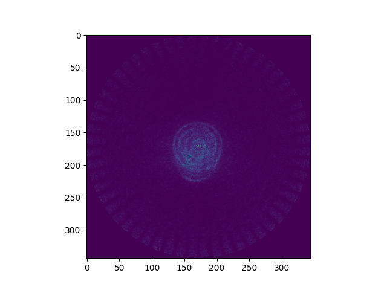

# PET Reconstruction

Side project of mine to play around with the reconstruction of 
Positron Emission Tomography (PET) images and get some hands-on
experience in C++.

Forward- and backprojection based on ray tracing using Siddon Algorithm.
Currently working on 2D transaxial slices through an image acquired on a 
Siemens Biograph MMR provided by [NiftyPET](https://niftypet.readthedocs.io/en/latest/data/). Sinogram histogramed from list mode data in PETLINK format.

Simple backprojection of the sinogram:

Reconstruction using Expectation Maximization with 20 Iterations (No corrections for randoms, scatter or anything else):

